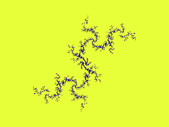
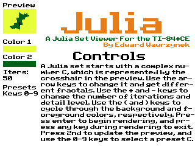

# Julia
A Julia set renderer for the TI-84 Plus CE, drawing an iterative fractal of the form *z*=*z*^2+*c*.

## Usage
#### Upload
To transfer to a calculator, send the `bin/julia.8xp` file to your calculator. If you get a message about needing `libload`, send all of the files in the `clibraries` directory to your calculator. These are the libraries that the program requires.
#### Usage

 The above image is of the main menu. On the main menu, parameters are set for the fractal. The following controls can be used: 
##### Controls
Enter: draw the fractal with the current parameters  
0-9 Keys: set the parameters to a series of presets. Use enter to draw.  
Arrow Keys: change the value of *c*. *c*'s value is represented by the crosshairs in the upper-left preview.  
2nd: update the preview in the upper-left to get an approzimation of what the fractal will look like. 
Plus and Minus keys: change the number of iterations 
( and ): change the colors for the background and foreground, repectivley. Press 2nd to draw preview in these colors. 
##### Exiting
During or after rendering, press and hold any key to exit.
